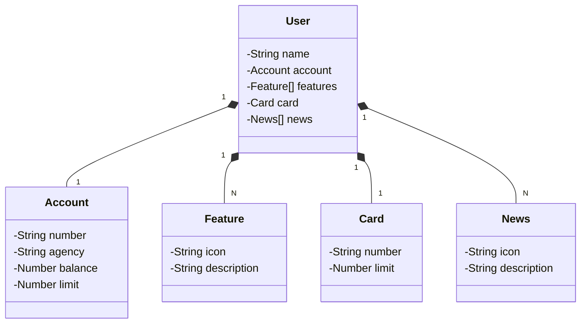

# Desafio Santander dev week 2024 🚩

Desafio baseado na aula "Publicando Sua API REST na Nuvem Usando Spring Boot 3, Java 17 e Railway".

## Objetivo 📜

Criar uma API REST na Nuvem Usando Spring Boot 3, Java 17 e Railway

## Diagrama de Classes

## Tecnologias 👨‍💻

Java version "22.0.1" 2024-04-16

Java(TM) SE Runtime Environment (build 22.0.1+8-16)

Java HotSpot(TM) 64-Bit Server VM (build 22.0.1+8-16, mixed mode, sharing)

JDK Compliance 1.6

Spring:
- Maven
- Spring Boot 3.3.2
- Packaging Jar
- Java 17
- Spring Web
- Spring data JPA
- H2 Database

## Referências 📚

https://github.com/falvojr/santander-dev-week-2023

## Atualizações 🕐

28/07/2024

Adição do projeto no github

## Pendências 🚨

